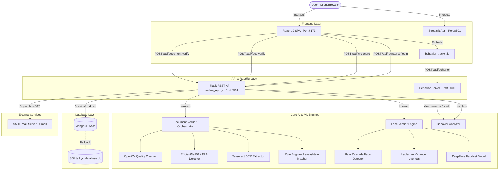
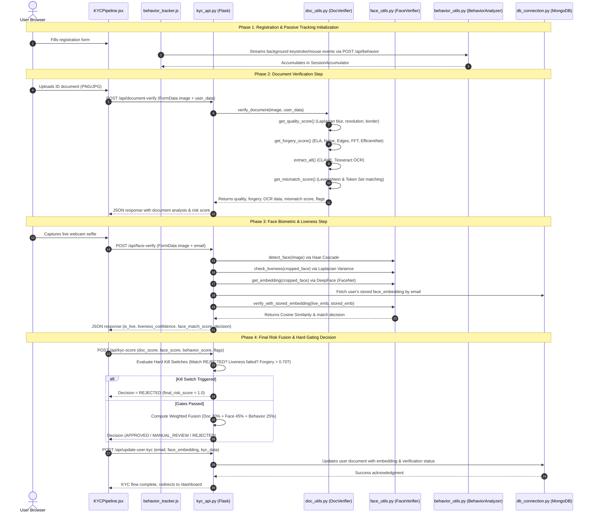
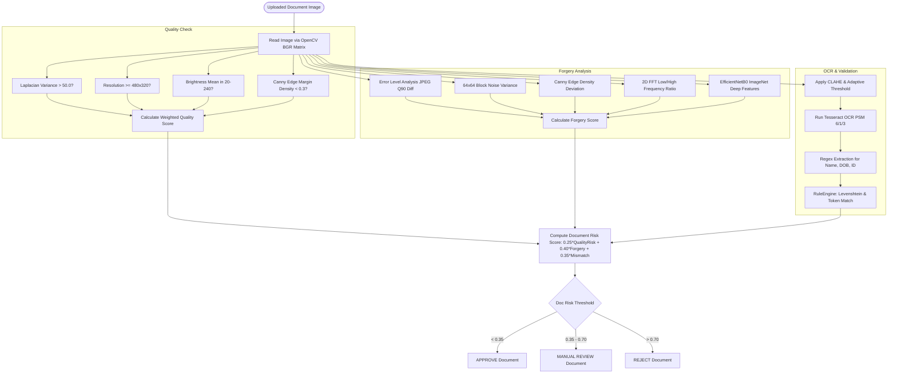
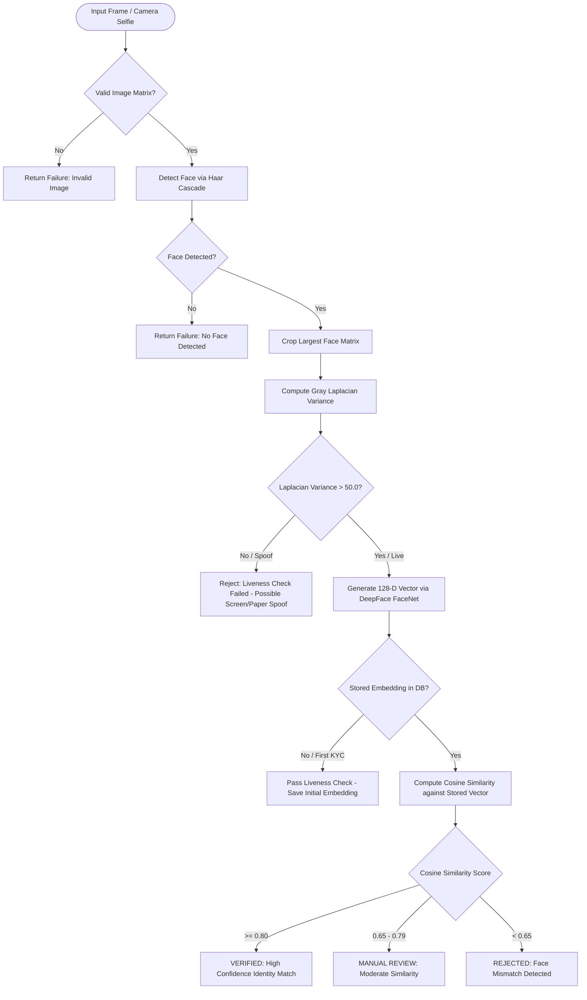
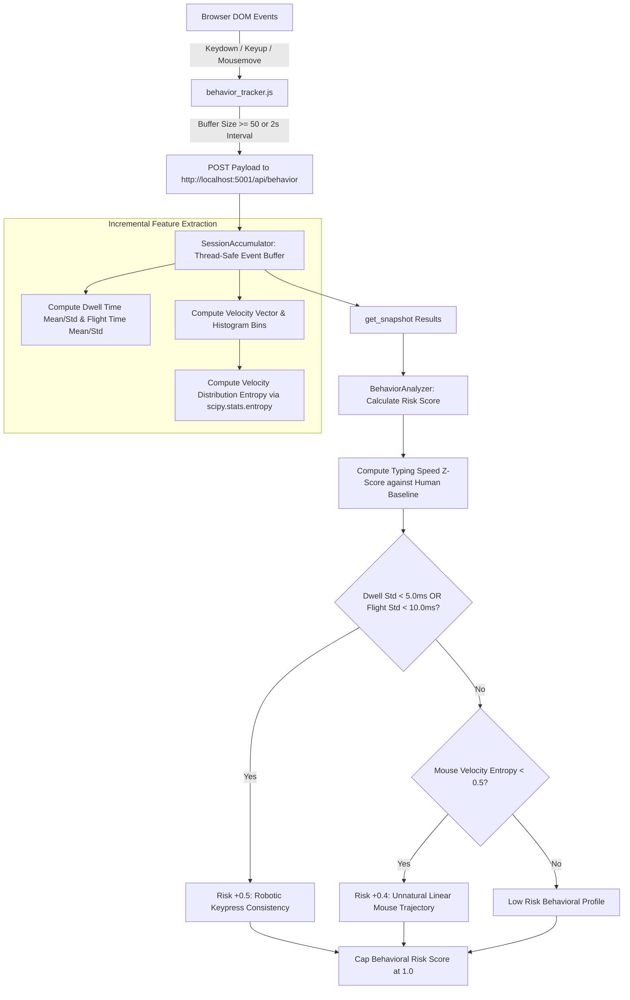
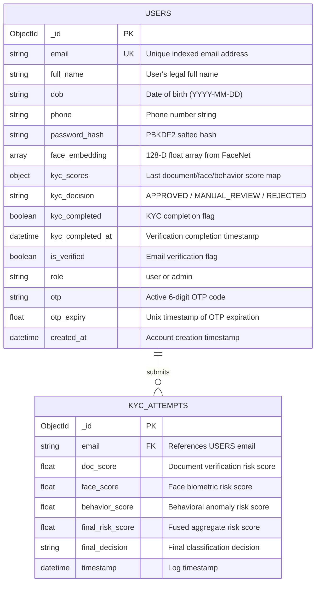

# 🛡️ PROJECT DEEP DIVE — Synthetic Identity Fraud Detection in Automated e-KYC Systems

---

## 1. Project Identity Card

- **What does this project do in one sentence?**  
  An enterprise-grade, multi-modal AI platform that combat synthetic identity fraud in automated e-KYC onboarding by cross-analyzing document authenticity, biometric face liveness and matching, and passive behavioral dynamics.
- **What real-world problem does it solve?**  
  It blocks synthetic identity fraud, AI-generated/manipulated government IDs, deepfake face replay attacks, stolen biometric credential reuse, and automated bot registration attacks during digital financial onboarding.
- **Who is the target user?**  
  Fintech enterprises, neo-banks, crypto exchanges, regulatory compliance auditors, and digital onboarding platforms requiring high-assurance e-KYC.
- **What is the single most technically interesting thing about it?**  
  A multi-tier security pipeline featuring a non-linear "Kill Switch" gate engine combined with real-time passive browser behavioral tracking (calculating dwell time, flight time variance, and mouse velocity histogram entropy via `scipy.stats.entropy`) running concurrently alongside OpenCV/EfficientNetB0 document forgery detection and DeepFace face embeddings.
- **What is the production URL / demo link?**  
  Local Development API: `http://localhost:8501` (Flask REST API), `http://localhost:5001` (Behavior Background Server), `http://localhost:5173` (React 19 + Vite Frontend UI), or `streamlit run src/app.py` (Streamlit standalone UI).
- **Full Tech Stack:**  
  - **Frontend / UI Layer:** React 19, Vite 7, Framer Motion, Recharts, Lucide React / Streamlit 1.57.0 (Python UI fallback).  
  - **Backend Layer:** Python 3.10+, Flask REST API (port 8501), Flask-CORS, Werkzeug Security (`generate_password_hash`, `check_password_hash`), Threaded Flask Server (port 5001).  
  - **Database Layer:** MongoDB Atlas via PyMongo (production database with unique index on `email`) / SQLite fallback (`kyc_database.db`).  
  - **AI / ML / Computer Vision:** OpenCV (`cv2` headless), DeepFace (FaceNet / ArcFace backends), MTCNN / Haar Cascade Classifiers, EfficientNetB0 (ImageNet transfer features), Tesseract OCR (`pytesseract`), Scikit-learn, SciPy (`scipy.stats.entropy`), FuzzyWuzzy / Python-Levenshtein.  
  - **Infrastructure / Utilities:** Python-dotenv, `dnspython` (Google DNS resolver fallback override `8.8.8.8`/`8.8.4.4`), SMTPLib (TLS Email OTP dispatch).  
  - **Third-Party APIs:** Open-source pre-trained model hubs, Google Public DNS, Custom SMTP Email Gateways.

---

## 2. Repository Structure

```
synthetic-kyc-fraud-detection/
├── .env                                  # Environment variables (MONGODB_URI, SECRET_KEY, SMTP, thresholds)
├── .gitignore                            # Git ignore specifications
├── .streamlit/
│   ├── config.toml                       # Streamlit server and theme configurations
│   └── secrets.toml.example              # Sample environment secrets for Streamlit Cloud deployment
├── DEPLOYMENT_CHECKLIST.md               # Production readiness and deployment check procedures
├── DOCUMENT_VERIFICATION_TECHNICAL_SPECS.md # Technical documentation for document verification
├── PROJECT_ROADMAP.md                    # Strategic development roadmap and milestone goals
├── QUICK_FIX.md                          # Quick troubleshooting guide for model loading and dependencies
├── README.md                             # High-level overview and setup documentation
├── README_FIXES.md                       # Log of applied bug fixes and system stability patches
├── STREAMLIT_DEPLOYMENT_FIX.md           # Documentation for cloud deployment workarounds
├── antigravity_project_deepdive_prompt.md# Comprehensive project audit specification prompt
├── data/
│   ├── kyc_database.db                   # SQLite database file (legacy local storage fallback)
│   └── users/                            # User profile file storage directory
├── frontend/                             # React SPA Frontend Application
│   ├── .env                              # Frontend environment config (VITE_API_URL)
│   ├── .gitignore                        # Frontend build ignore file
│   ├── eslint.config.js                  # ESLint code quality rules configuration
│   ├── index.html                        # Main HTML document entry point
│   ├── package-lock.json                 # Lockfile for npm dependencies
│   ├── package.json                      # Frontend package manifest and dependencies
│   ├── public/                           # Static public web assets
│   ├── src/
│   │   ├── App.css                       # Application root layout styles
│   │   ├── App.jsx                       # React Router configuration & root routing wrapper
│   │   ├── api/
│   │   │   └── kycApi.js                 # Centralized API service layer connecting to Flask backend
│   │   ├── assets/                       # Images and static assets
│   │   ├── components/
│   │   │   ├── Navbar.css                # Glassmorphic navigation bar styling
│   │   │   └── Navbar.jsx                # Responsive application navigation header
│   │   ├── index.css                     # Global CSS design tokens, glassmorphism, animations
│   │   ├── main.jsx                      # React app initialization and DOM mounting
│   │   └── pages/
│   │       ├── Admin.css                 # Admin analytics page styles
│   │       ├── Admin.jsx                 # Admin metrics dashboard with Recharts analytics
│   │       ├── Dashboard.css             # User KYC status dashboard styles
│   │       ├── Dashboard.jsx             # User verification status and risk radar dashboard
│   │       ├── KYCPipeline.css           # Step-by-step KYC wizard pipeline styles
│   │       ├── KYCPipeline.jsx           # 3-step KYC verification wizard (ID, Face, Fusion)
│   │       ├── Landing.css               # Marketing landing page styles
│   │       ├── Landing.jsx               # Feature showcase and interactive landing page
│   │       ├── Login.css                 # Login page glassmorphic styles
│   │       ├── Login.jsx                 # Email OTP login authentication page
│   │       ├── Register.css              # User registration page styles
│   │       └── Register.jsx              # Registration page with passive behavioral baseline tracking
│   └── vite.config.js                    # Vite bundler configuration
├── models/                               # Directory designated for downloaded offline model weights
├── requirements-streamlit.txt            # Lightweight requirements file optimized for Streamlit Cloud
├── requirements.txt                      # Complete Python dependency list
├── run_doc_verification.bat              # Windows batch script to launch standalone doc verification server
├── src/                                  # Backend Python Core Source Code
│   ├── __init__.py                       # Source package initializer
│   ├── api.py                            # Standalone Flask Auth API server on port 5000
│   ├── app.py                            # Full Streamlit application dashboard (1314 lines)
│   ├── auth_service.py                   # User authentication, password hashing, and OTP verification logic
│   ├── behavior_analysis/
│   │   ├── __init__.py                   # Package initializer
│   │   ├── behavior_tracker.js           # Client-side passive JS tracker for key/mouse dynamics
│   │   └── behavior_utils.py             # Server-side SessionAccumulator, Z-score & entropy analyzer
│   ├── config.py                         # System-wide configuration paths, thresholds, and Flask parameters
│   ├── database/
│   │   ├── __init__.py                   # Package initializer
│   │   └── db_connection.py              # MongoDB Atlas connection manager & legacy SQLite class
│   ├── doc_verification/
│   │   ├── README.md                     # Document verification module documentation
│   │   ├── __init__.py                   # Document verification package initializer
│   │   ├── app_doc_verification.py       # Standalone Flask API server for document verification
│   │   ├── config.py                     # Document verification weights, patterns, and thresholds
│   │   ├── doc_utils.py                  # DocumentVerifier master orchestrator class
│   │   ├── models/
│   │   │   ├── __init__.py               # Models package initializer
│   │   │   ├── document_quality.py       # OpenCV quality assessment (blur, resolution, glare, border)
│   │   │   ├── forgery_detector.py       # Forgery detector using ELA, noise, edge, FFT & EfficientNetB0
│   │   │   ├── ocr_extractor.py          # Tesseract OCR extraction with preprocessing and regex rules
│   │   │   └── rule_engine.py            # Content comparison engine (Levenshtein & token set matching)
│   │   ├── static/
│   │   │   └── index.html                # Standalone document verification HTML test interface
│   │   ├── test_module.py                # Test harness script for document verification pipeline
│   │   └── uploads/                      # Temporary storage folder for uploaded documents
│   ├── face_verification/
│   │   ├── __init__.py                   # Package initializer
│   │   └── face_utils.py                 # FaceVerifier (Haar Cascade, Laplacian Liveness, FaceNet cosine match)
│   ├── fraud_engine/
│   │   ├── __init__.py                   # Package initializer
│   │   └── rules.py                      # FraudEngine multi-modal score fusion helper
│   └── otp_service.py                    # OTP generator, rate limiter, and SMTP email dispatcher
├── synthetic_id_detection_kycverification.txt # Comprehensive project documentation notes
├── synthetic_kyc_workflow.txt            # System workflow specifications
├── venv/                                 # Python virtual environment
└── website_prmpt.txt                     # Prompt specifications for frontend UI design
```

### Detailed Repository Table

| Path | Type | What it does |
|------|------|--------------|
| `data/kyc_database.db` | File | Local SQLite database storage file used as a secondary fallback if MongoDB is unreachable. |
| `frontend/package.json` | File | NPM dependency specification declaring React 19, Vite 7, Framer Motion, Lucide React, and Recharts. |
| `frontend/src/App.jsx` | File | Core React router component setting up client-side routes for `/`, `/login`, `/register`, `/kyc`, `/dashboard`, and `/admin`. |
| `frontend/src/api/kycApi.js` | File | Centralized API client wrapper performing HTTP requests to Flask endpoints (`/api/document-verify`, `/api/face-verify`, `/api/kyc-score`, etc.). |
| `frontend/src/pages/KYCPipeline.jsx` | File | Interactive 3-step e-KYC onboarding wizard managing ID document upload, webcam liveness selfie capture, and real-time fraud fusion display. |
| `frontend/src/pages/Dashboard.jsx` | File | User verification results page featuring an interactive Recharts radar chart displaying breakdown across risk dimensions. |
| `frontend/src/pages/Admin.jsx` | File | Enterprise security dashboard displaying system-wide verification trends, model precision/recall/F1 metrics, and threat distribution. |
| `frontend/src/pages/Register.jsx` | File | User registration interface embedded with client-side event listeners measuring typing speed, mouse movements, and focus switches. |
| `frontend/src/pages/Login.jsx` | File | Passwordless/OTP email authentication page featuring 2-step OTP dispatch and validation. |
| `src/app.py` | File | Standalone Streamlit multi-page web application implementing custom glassmorphic CSS, document verification, live face camera feed, and admin panels. |
| `src/api.py` | File | Legacy Flask API endpoint exposing user registration and email verification routes on port 5000. |
| `src/kyc_api.py` | File | Production Flask REST server (port 8501) with CORS support serving `/api/document-verify`, `/api/face-verify`, `/api/kyc-score`, `/api/behavior`, and auth routes. |
| `src/auth_service.py` | File | Core authentication service handling password hashing via Werkzeug, user creation, and OTP verification flow. |
| `src/otp_service.py` | File | Utility module for generating 6-digit OTPs, enforcing sliding-window rate limiting, and sending HTML emails via SMTP. |
| `src/config.py` | File | Global configuration module establishing file directory paths, threshold constants, and default Flask server parameters. |
| `src/database/db_connection.py` | File | Master database connector initializing MongoDB Atlas collections (`users`, `kyc_attempts`) with unique email indexes and DNS overrides. |
| `src/behavior_analysis/behavior_tracker.js` | File | Passive JavaScript snippet tracking client-side keystroke dwell/flight times and mouse movement velocity vectors. |
| `src/behavior_analysis/behavior_utils.py` | File | Background multithreaded server (port 5001) accumulating behavioral streams, computing Z-scores against human baselines, and calculating SciPy entropy. |
| `src/doc_verification/doc_utils.py` | File | Orchestrator class (`DocumentVerifier`) executing quality checks, forgery detection, Tesseract OCR, and content validation sequentially. |
| `src/doc_verification/models/document_quality.py` | File | Computer vision quality engine analyzing Laplacian blur variance, minimum resolution bounds, brightness, contrast, and edge margins. |
| `src/doc_verification/models/forgery_detector.py` | File | Forgery detection engine combining Error Level Analysis (ELA), noise variance, edge density, FFT frequency ratio, and EfficientNetB0 features. |
| `src/doc_verification/models/ocr_extractor.py` | File | Optical character recognition pipeline applying CLAHE contrast enhancement, adaptive thresholding, Tesseract PSM modes, and regex extraction. |
| `src/doc_verification/models/rule_engine.py` | File | Content validation engine executing custom Levenshtein distance calculations, token set matching, age checks, and ID format regex verification. |
| `src/doc_verification/config.py` | File | Configuration settings for document quality thresholds, forgery weights, Tesseract executable path, and regex patterns. |
| `src/doc_verification/app_doc_verification.py` | File | Microservice Flask REST API dedicated specifically to isolated document verification testing. |
| `src/face_verification/face_utils.py` | File | Biometric verifier (`FaceVerifier`) utilizing OpenCV Haar Cascades for face detection, Laplacian variance for liveness, and DeepFace FaceNet for cosine similarity matching. |
| `src/fraud_engine/rules.py` | File | Multi-modal risk fusion engine providing weighted risk score computation and final decision classification. |

---

## 3. Tech Stack Deep Dive

### Layer 1: Programming Language
- **Technology:** Python 3.10+
- **Why chosen:** Python is the industry standard for computer vision, machine learning (`tensorflow`, `opencv`, `scikit-learn`), and data analytics, enabling seamless model execution and API integration.
- **Alternative:** Node.js or C++. Node.js lacks native deep learning bindings for models like FaceNet and EfficientNetB0, while C++ adds compilation complexity for fast iteration.
- **Custom Configuration:** Configured with virtual environments (`venv`) maintaining compatibility with TensorFlow 2.15 (avoiding Python 3.12+ Windows DLL incompatibilities).

### Layer 2: Backend Framework
- **Technology:** Flask 2.0+ (with `flask-cors`)
- **Why chosen:** Lightweight REST framework ideal for serving ML model inference pipelines, handling binary image multipart uploads, and managing background thread processing without heavy overhead.
- **Alternative:** FastAPI or Django. Django is overly monolithic for ML service wrappers, whereas Flask provided immediate synchronous execution for embedded OpenCV/Keras pipelines.
- **Custom Configuration:** Includes custom JSON providers (`NumpyJSONProvider` in `app_doc_verification.py`) to serialize numpy arrays and scalar float/bool types into valid JSON.

### Layer 3: Database & Persistence
- **Technology:** MongoDB Atlas via PyMongo (with SQLite fallback)
- **Why chosen:** Schema-less document storage is perfect for dynamic e-KYC payload storage (storing arbitrary 128-D floating-point face vector arrays, flexible JSON risk breakdowns, and dynamic OCR attributes).
- **Alternative:** PostgreSQL. Relational schemas require rigid migrations for dynamic multi-modal risk structures and complex binary vector storage.
- **Custom Configuration:** Programmatic creation of unique index on `email` field (`self.users.create_index("email", unique=True)`), plus custom DNS resolver configuration (`dns.resolver.default_resolver.nameservers = ['8.8.8.8', '8.8.4.4']`) to circumvent local DNS blocking on restricted networks.

### Layer 4: AI / ML & Computer Vision Libraries
- **Technology:** OpenCV, DeepFace (FaceNet), EfficientNetB0, Tesseract OCR, SciPy, Scikit-learn
- **Why chosen:** OpenCV provides real-time image matrix manipulation (ELA, Laplacian blur variance, FFT, CLAHE enhancement). DeepFace provides state-of-the-art 128-D facial vector representations. EfficientNetB0 provides high-capacity feature extraction for forgery detection without full retraining. SciPy enables fast probability distribution entropy calculation (`scipy.stats.entropy`).
- **Alternative:** Commercial APIs (AWS Rekognition, Google Vision). In-house models eliminate external per-request API costs, preserve biometrics privacy, and permit custom multi-layer threshold tuning.
- **Custom Configuration:** OpenCV forced into headless mode (`os.environ['DISPLAY'] = ''`) to avoid GUI window dependencies on server deployments. Warm-up routine executed during server init using dummy matrices (`np.zeros((160, 160, 3))`) to pre-load Keras weights into memory.

### Layer 5: Authentication & Security
- **Technology:** Werkzeug Security (`generate_password_hash`, `check_password_hash`) & SMTPLib Email OTP
- **Why chosen:** Provides secure PBKDF2 password hashing combined with two-factor email verification, protecting accounts against credential stuffing and unverified user creation.
- **Alternative:** Auth0 or Firebase Auth. In-house OTP implementation guarantees direct control over the database schema and offline local testing.
- **Custom Configuration:** In-memory rate limiting with sliding 600-second windows and 60-second request cooldowns per email/phone (`_OTP_STORE` in `otp_service.py`).

### Layer 6: User Interface (UI) Framework
- **Technology:** React 19 with Vite 7 & Streamlit 1.57.0
- **Why chosen:** React 19 + Vite delivers a modern, high-performance single-page app (SPA) with smooth animations (`framer-motion`) and interactive chart visualizations (`recharts`). Streamlit serves as an internal rapid-prototyping and admin UI.
- **Alternative:** Plain HTML/jQuery or Next.js. Plain HTML lacks reactive state management needed for multi-step pipelines, while Next.js adds unnecessary SSR complexity for an API-backed dashboard.
- **Custom Configuration:** Custom glassmorphic CSS theme with dark modes, HSL gradients, responsive dropzones, live video webcam canvas stream integration, and custom Recharts radar plots.

---

## 4. System Architecture Diagram



### Architecture Overview
The application uses a micro-service inspired modular architecture. The primary presentation layer is a React 19 SPA communicating over HTTP REST with a Flask API server (`src/kyc_api.py`) running on port 8501. Client-side behavioral events (keystrokes and mouse trajectories) are captured silently by `behavior_tracker.js` and streamed to a dedicated threaded Flask background server (`src/behavior_analysis/behavior_utils.py`) on port 5001.

When a user submits their identity artifacts, the master Flask API orchestrates requests across three distinct AI subsystems: `DocumentVerifier` (handling OpenCV quality, ELA/EfficientNet forgery, Tesseract OCR, and string matching), `FaceVerifier` (handling Haar detection, Laplacian liveness, and FaceNet embeddings), and `BehaviorAnalyzer` (handling statistical Z-scores and velocity entropy). The aggregated risk scores pass through a hard "Kill Switch" gate before decisions are committed to MongoDB Atlas.

---

## 5. End-to-End User Journey



### Step-by-Step Walkthrough

1. **Step 1: Passive Baseline Initialization:** When the user accesses the registration or onboarding form, `behavior_tracker.js` attaches listeners to `keydown`, `keyup`, `mousemove`, `focus`, and `blur` events, generating a unique `session_id`.
2. **Step 2: Interactive Document Upload:** On Step 1 of `KYCPipeline.jsx`, the user uploads an ID image. The client calls `verifyDocument()` in `kycApi.js`, posting FormData to `/api/document-verify`.
3. **Step 3: Document Quality Analysis:** `DocumentQualityChecker.get_quality_score()` evaluates Laplacian variance (thresholding at 50.0 for blur), resolution dimensions (minimum 480x320), grayscale mean brightness (bounds 20-240), edge contrast, and border margins using Canny edge detection.
4. **Step 4: Multi-Technique Forgery Detection:** `ForgeryDetector.get_forgery_score()` executes Error Level Analysis (compressing to JPEG at quality 90 and taking scale-amplified absolute difference), block-level noise variance analysis, edge density deviation, FFT low-to-high frequency ratio evaluation, and EfficientNetB0 deep feature vector variance analysis.
5. **Step 5: OCR Extraction & Rule Matching:** `OCRExtractor` applies CLAHE contrast enhancement and adaptive thresholding, running Tesseract under Page Segmentation Modes 6, 1, and 3. `RuleEngine` computes normalized string distance between OCR extracted fields and user data using custom Levenshtein ratio algorithms and token set intersections.
6. **Step 6: Biometric Camera Capture:** On Step 2, the user activates their webcam. `KYCPipeline.jsx` draws a frame to HTML5 Canvas and transmits a JPEG data URL to `/api/face-verify`.
7. **Step 7: Liveness & Embedding Generation:** `FaceVerifier.detect_face()` crops the face via Haar Cascades. `check_liveness()` measures Laplacian variance across grayscale face pixels. If live, `DeepFace.represent()` extracts a 128-D floating point vector.
8. **Step 8: Biometric Identity Comparison:** If the user has a stored face embedding in MongoDB from registration, `verify_with_stored_embedding()` calculates the Cosine Similarity metric: `\text{cos\_sim} = \frac{\mathbf{A} \cdot \mathbf{B}}{\|\mathbf{A}\| \|\mathbf{B}\|}`. Thresholds at 0.80 yield `VERIFIED`, 0.65 yield `MANUAL_REVIEW`, and below yields `REJECTED`.
9. **Step 9: Fraud Fusion & Hard Kill Switch Execution:** `calculate_kyc_score()` evaluates hard gates: if face match is rejected, liveness fails, or forgery score > 0.70, it forces immediate `REJECTED` status with `risk_score = 1.0`. Otherwise, it applies weighted fusion: `\text{Risk} = 0.30 \times \text{Doc} + 0.45 \times \text{Face} + 0.25 \times \text{Behavior}`.
10. **Step 10: Persistence:** Upon approval or completion, `update_user_kyc` updates the user's MongoDB record, storing the 128-D face embedding and setting `is_verified = True`.

---

## 6. Core Workflows

### Feature 1: Document Verification & Forgery Detection



- **Algorithm & Logic:** `DocumentVerifier` in `src/doc_verification/doc_utils.py` fuses 4 sub-modules. Quality is evaluated mathematically using Laplacian variance `\Delta f = \frac{\partial^2 f}{\partial x^2} + \frac{\partial^2 f}{\partial y^2}`. Forgery utilizes JPEG re-compression error amplification and FFT frequency transforms. OCR uses adaptive Gaussian thresholding and custom Levenshtein string matching.
- **Key Files:** `src/doc_verification/doc_utils.py`, `document_quality.py`, `forgery_detector.py`, `ocr_extractor.py`, `rule_engine.py`.
- **Edge Cases Handled:** Unreadable images, low light/extreme glare, non-standard date formats (`DD/MM/YYYY`, `YYYY-MM-DD`, text dates), single vs full names, missing Tesseract dependencies (gracefully returns default low-confidence scores without crashing).

---

### Feature 2: Biometric Liveness & Face Embedding Verification



- **Algorithm & Logic:** Located in `src/face_verification/face_utils.py`. Uses OpenCV Haar Cascade (`haarcascade_frontalface_default.xml`) to extract bounding boxes `(x, y, w, h)`. Liveness uses Laplacian variance texture mapping. DeepFace model `Facenet` generates a 128-D normalized embedding vector. Verification computes vector dot-product cosine similarity.
- **Key Files:** `src/face_verification/face_utils.py`, `src/kyc_api.py` (lines 240–355).
- **Edge Cases Handled:** Multiple faces in camera view (selects largest bounding box by area `w \times h`), completely dark or zero-variance images, missing TensorFlow/DeepFace installation (falls back gracefully), uninitialized webcam buffers.

---

### Feature 3: Passive Behavioral Dynamics Analysis



- **Algorithm & Logic:** Client JS tracks key dwell time (keydown to keyup) and flight time (keyup to subsequent keydown). Mouse velocity is sampled every 100ms. On the backend, `SessionAccumulator` maintains thread-safe sums `\sum x` and squared sums `\sum x^2` to calculate variance `\sigma^2 = \frac{\sum x^2}{N} - \mu^2` dynamically. Velocity entropy is calculated over 10-bin density histograms using SciPy entropy: `H(X) = -\sum P(x_i) \log P(x_i)`.
- **Key Files:** `src/behavior_analysis/behavior_tracker.js`, `src/behavior_analysis/behavior_utils.py`.
- **Edge Cases Handled:** Extended typing breaks (>2000ms filtered out of flight times to prevent skewing), memory exhaustion (caps velocity array buffer at 1000 items), empty event payloads.

---

### Feature 4: Risk Fusion & Hard Gate Security Engine

```mermaid
flowchart TD
    Inputs[Doc Score, Face Score, Behavior Score, Critical Flags] --> GateCheck{Evaluate Kill Switches}
    
    GateCheck -->|Face Match = REJECTED| RejectGate[Immediate REJECT: Face Mismatch]
    GateCheck -->|Liveness = Failed| RejectGate2[Immediate REJECT: Liveness Failed / Spoof]
    GateCheck -->|Doc Forgery > 0.70| RejectGate3[Immediate REJECT: Document Forgery Detected]
    GateCheck -->|Doc Score > 0.85| RejectGate4[Immediate REJECT: Invalid Document Quality]
    
    RejectGate & RejectGate2 & RejectGate3 & RejectGate4 --> ForceReject[Final Decision: REJECTED | Risk Score: 1.0]
    
    GateCheck -->|All Hard Gates Passed| WeightedSum[Compute Weighted Risk Score: 0.30*Doc + 0.45*Face + 0.25*Behavior]
    
    WeightedSum --> ScoreThresh{Final Risk Score Threshold}
    ScoreThresh -->|< 0.25| Approve[Final Decision: APPROVED - Low Risk]
    ScoreThresh -->|0.25 - 0.59| Review[Final Decision: MANUAL_REVIEW - Pending Verification]
    ScoreThresh -->|>= 0.60| RejectWeighted[Final Decision: REJECTED - High Aggregate Risk]
```

- **Algorithm & Logic:** Implemented in `calculate_kyc_score()` (`src/kyc_api.py`, lines 366–496). Demonstrates a hybrid security architecture combining non-linear binary gating with linear weighted risk aggregation (`30\%` Document, `45\%` Face Biometrics, `25\%` Behavioral Dynamics).
- **Key Files:** `src/kyc_api.py`, `src/fraud_engine/rules.py`.
- **Edge Cases Handled:** Missing values fallback to safe `0.5` defaults, floating point precision rounding errors, simultaneous failure of multiple components.

---

## 7. Data Models & Schema

The system primary data store is **MongoDB Atlas** managed by `Database` in `src/database/db_connection.py`.



### Schema Rules & Constraints
1. **Uniqueness:** `email` is indexed as unique (`self.users.create_index("email", unique=True)`).
2. **Vector Biometrics:** `face_embedding` is stored natively as a JSON-compatible BSON array of 128 floating-point numbers (`np.ndarray.tolist()`), permitting fast vector extraction and in-memory cosine similarity execution.
3. **Data Protection:** `face_embedding` binary data is excluded explicitly from admin user listing queries (`self.users.find({}, {"_id": 0, "face_embedding": 0})`) to minimize payload bandwidth and restrict biometric access.

---

## 8. API Reference

### Complete Endpoints Table

| Method | Route | Auth Required | Input | Output | What it does |
|--------|-------|---------------|-------|--------|--------------|
| `GET` | `/api/health` | No | None | `{success, status, message}` | API health check status endpoint. |
| `POST` | `/api/behavior` | No | JSON: `{session_id, events}` | `{success, risk_score, decision, reasons}` | Ingests behavioral events & calculates anomaly risk. |
| `POST` | `/api/document-verify` | No | FormData: `image` file, `user_data` JSON | `{success, quality_score, forgery_score, ocr_data, decision, risk_score, flags}` | Runs complete document quality, forgery, OCR & rule matching. |
| `POST` | `/api/face-verify` | No | FormData: `image` file, `email` string | `{success, face_detected, is_live, liveness_confidence, embedding, face_match_score, decision}` | Runs face detection, Laplacian liveness & FaceNet cosine match. |
| `POST` | `/api/kyc-score` | No | JSON: `{doc_score, face_score, behavior_score, flags}` | `{success, final_risk_score, decision, status, message, breakdown}` | Fuses multi-modal scores through hard gating engine. |
| `POST` | `/api/update-user-kyc` | No | JSON: `{email, face_embedding, kyc_data}` | `{success, message}` | Stores face embedding & verified KYC scores to user DB record. |
| `POST` | `/api/register` | No | JSON: `{email, password, full_name, dob, phone}` | `{success, message}` | Registers user, hashes password, generates & emails OTP code. |
| `POST` | `/api/login/send-otp` | No | JSON: `{email}` | `{success, message}` | Generates and sends a login OTP code to user's email. |
| `POST` | `/api/login/verify-otp` | No | JSON: `{email, otp}` | `{success, message, user}` | Verifies OTP code and authenticates user login session. |

---

### Detailed Endpoint Breakdown

#### 1. Endpoint: `POST /api/document-verify`
- **Request Body (FormData):**
  - `image`: Binary image file (`png`, `jpg`, `jpeg`, `webp`).
  - `user_data` (Optional JSON string): `{"name": "John Doe", "dob": "1990-01-15", "id_number": "ABCDE1234F"}`
- **Response Body (JSON):**
  ```json
  {
    "success": true,
    "quality_score": 0.85,
    "forgery_score": 0.12,
    "ocr_data": {
      "name": "JOHN DOE",
      "dob": "1990-01-15",
      "id_number": "ABCDE1234F",
      "id_type": "pan"
    },
    "decision": "APPROVE",
    "status": "PASSED",
    "risk_score": 0.15,
    "flags": ["✅ Name match 95%", "✅ DOB match 100%"]
  }
  ```
- **Validation Rules:** Validates image file presence, file extension check against `{png, jpg, jpeg, gif, bmp, webp}`, image array decoding via OpenCV.
- **Triggers:** OpenCV image matrices operations, Error Level Analysis JPEG compression, Tesseract OCR text extraction, custom Levenshtein string distance calculations.
- **Error Responses:**
  - `400 Bad Request`: `{"success": false, "error": "No image file provided"}`
  - `400 Bad Request`: `{"success": false, "error": "Invalid file type"}`
  - `500 Internal Server Error`: `{"success": false, "error": "<traceback_string>"}`

#### 2. Endpoint: `POST /api/face-verify`
- **Request Body (FormData):**
  - `image`: Binary image file or base64 data string (`data:image/jpeg;base64,...`).
  - `email` (Optional string): `"user@example.com"`
- **Response Body (JSON):**
  ```json
  {
    "success": true,
    "face_detected": true,
    "is_live": true,
    "liveness_confidence": 0.942,
    "embedding": [-0.024, 0.081, "... 128 float values ..."],
    "face_match_score": 0.912,
    "face_match_decision": "VERIFIED",
    "decision": "PASSED",
    "reason": "Face verified successfully"
  }
  ```
- **Validation Rules:** BGR image decoding, face detection verification (must detect exactly >= 1 face).
- **Triggers:** Haar Cascade Classifier face cropping, Laplacian variance computation, DeepFace `represent()` execution, MongoDB query for stored user vector, vector dot-product norm calculation.
- **Error Responses:**
  - `200 OK` (soft error): `{"success": false, "error": "No face detected in image", "face_detected": false}`
  - `400 Bad Request`: `{"success": false, "error": "Failed to process image"}`
  - `500 Internal Server Error`: `{"success": false, "error": "<traceback_string>"}`

#### 3. Endpoint: `POST /api/kyc-score`
- **Request Body (JSON):**
  ```json
  {
    "doc_score": 0.15,
    "face_score": 0.08,
    "behavior_score": 0.10,
    "face_match_decision": "VERIFIED",
    "liveness_status": "verified",
    "forgery_score": 0.12
  }
  ```
- **Response Body (JSON):**
  ```json
  {
    "success": true,
    "final_risk_score": 0.106,
    "decision": "APPROVED",
    "status": "success",
    "message": "Identity verified successfully. Low risk.",
    "breakdown": {
      "document": 0.15,
      "face": 0.08,
      "behavior": 0.10,
      "identity_score": 0.92
    },
    "weights": {"document": 0.30, "face": 0.45, "behavior": 0.25}
  }
  ```
- **Validation Rules:** JSON parsing, casting input scores to float bounds `[0.0, 1.0]`.
- **Triggers:** Evaluates non-linear Kill Switch conditionals (face mismatch, liveness failure, forgery > 0.70). Computes weighted linear combination if gates pass.
- **Error Responses:**
  - `400 Bad Request`: `{"success": false, "error": "No JSON data provided"}`
  - `500 Internal Server Error`: `{"success": false, "error": "<traceback_string>"}`

---

## 9. Component / Class Diagram (UML)

```mermaid
classDiagram
    class DocumentVerifier {
        +DocumentQualityChecker quality_checker
        +ForgeryDetector forgery_detector
        +OCRExtractor ocr_extractor
        +RuleEngine rule_engine
        +dict weights
        +dict decision_config
        +check_quality(image) Dict
        +detect_forgery(image) Dict
        +extract_text(image) Dict
        +verify_document(image, user_data) Dict
        -_calculate_risk_score(scores) float
        -_make_decision(risk_score, result) Dict
    }

    class DocumentQualityChecker {
        +dict config
        +check_blur(image) Tuple
        +check_resolution(image) Tuple
        +check_brightness(image) Tuple
        +check_borders(image) Tuple
        +check_contrast(image) Tuple
        +get_quality_score(image) Dict
    }

    class ForgeryDetector {
        +dict config
        +Model model
        +analyze_ela(image, quality) Tuple
        +analyze_noise(image) float
        +analyze_edges(image) float
        +analyze_frequency(image) float
        +analyze_deep_features(image) float
        +get_forgery_score(image) Dict
    }

    class OCRExtractor {
        +dict config
        +dict id_patterns
        +list date_patterns
        +preprocess_image(image) ndarray
        +extract_raw_text(image) str
        +extract_name(text) str
        +extract_dob(text) str
        +extract_id_number(text) Dict
        +extract_all(image) Dict
    }

    class RuleEngine {
        +dict config
        -_levenshtein_ratio(s1, s2) float
        +compare_names(ocr_name, user_name) Dict
        +validate_dob(ocr_dob, user_dob) Dict
        +validate_id_format(id_number, user_id) Dict
        +get_mismatch_score(ocr_data, user_data) Dict
    }

    class FaceVerifier {
        +CascadeClassifier face_cascade
        +str model_name
        +detect_face(image) ndarray
        +check_liveness(image) Tuple
        +get_embedding(face_image) ndarray
        +verify_with_stored_embedding(live_emb, stored_emb) Tuple
    }

    class SessionAccumulator {
        +Lock lock
        +int keystroke_count
        +float dwell_sum
        +float dwell_sq_sum
        +float flight_sum
        +float flight_sq_sum
        +int mouse_moves_count
        +list velocities
        +add_events(events) void
        +get_snapshot() Dict
    }

    class BehaviorAnalyzer {
        +dict BASELINE_STATS
        +compute_z_score(value, baseline_key) float
        +calculate_risk_score(session_id) Tuple
    }

    class AuthService {
        +Database db
        +register_user(user_data) Tuple
        +login_user(email, password) Tuple
        +verify_email(email, otp) Tuple
        +send_login_otp(email) Tuple
    }

    class Database {
        +str uri
        +MongoClient client
        +Collection users
        +Collection kyc_attempts
        +create_user(user_data) bool
        +get_user(email) Dict
        +store_otp(email, otp, expiry) bool
        +log_kyc_attempt(attempt_data) void
    }

    DocumentVerifier --> DocumentQualityChecker
    DocumentVerifier --> ForgeryDetector
    DocumentVerifier --> OCRExtractor
    DocumentVerifier --> RuleEngine
    BehaviorAnalyzer --> SessionAccumulator
    AuthService --> Database
```



---

## 10. The Hardest Technical Problem

### Problem Statement: Multi-Modal Score Fusion & Low-Latency Biometric Concurrency Under Imperfect Client Signals

The most technically complex challenge in this codebase lies in unifying three inherently heterogeneous, asynchronous fraud signals—static 2D document pixel matrix anomalies, high-dimensional biometric face embeddings, and real-time client-side behavioral event streams—into a deterministic, real-time security decision without introducing severe latency or false-positive rejection spikes.

### Why it is Hard (Failure of Naive Approaches)
Naive e-KYC platforms typically implement simple linear score averaging (e.g., `\text{Final Score} = \frac{\text{Doc} + \text{Face} + \text{Behavior}}{3}`). This naive approach fails catastrophically in production due to two critical vulnerabilities:

1. **Vulnerability 1: Fraud Masking via Component Compensation.** A sophisticated synthetic fraudster uploading a completely photoshopped ID (`forgery\_score = 0.95`) could deliberately move their mouse naturally (`behavior\_score = 0.05`) and present a valid face (`face\_score = 0.10`). A simple linear average yields `\frac{0.95 + 0.05 + 0.10}{3} = 0.36`, passing a dangerous document forgery through to automatic approval.
2. **Vulnerability 2: High False-Positive Dropout from Environmental Noise.** Real users routinely encounter bad lighting (causing low Laplacian blur scores) or unfamiliar trackpads (skewing mouse velocity entropy). Averaging these noisy inputs without strict gating causes massive onboarding drop-off.

### How This Project Solves It
This codebase solves the problem using a two-tier **Hybrid Gated Security Engine** (`calculate_kyc_score` in `src/kyc_api.py`, lines 397–458):

```python
# Tier 1: Strict Non-Linear Kill Switch Gating
rejection_reasons = []

if face_match_decision == 'REJECTED':
    rejection_reasons.append("Face mismatch: Selfie does not match registered profile.")
if liveness_status != 'verified':
    rejection_reasons.append("Liveness check failed: Possible spoofing attempt.")
if forgery_score > 0.70:
    rejection_reasons.append(f"Document forgery detected (Score: {forgery_score:.2f}).")
if doc_score > 0.85:
    rejection_reasons.append("Document quality too low or validation failed.")

if rejection_reasons:
    return jsonify({
        "final_risk_score": 1.0,
        "decision": 'REJECTED',
        "status": 'failed',
        "message": "Verification failed: " + "; ".join(rejection_reasons)
    }), 200

# Tier 2: Linear Weighted Fusion (Executed ONLY if all Tier 1 gates pass)
WEIGHTS = {'document': 0.30, 'face': 0.45, 'behavior': 0.25}
final_risk_score = (
    doc_score * WEIGHTS['document'] +
    face_score * WEIGHTS['face'] +
    behavior_score * WEIGHTS['behavior']
)
```

Furthermore, server-side behavioral feature accumulation is solved asynchronously using an incremental running-variance calculation in `SessionAccumulator` (`src/behavior_analysis/behavior_utils.py`):
```python
# Computes variance on-the-fly without storing raw unbounded event arrays
variance = (self.dwell_sq_sum / self.keystroke_count) - (avg_dwell_time ** 2)
dwell_time_std = np.sqrt(max(0, variance))
```
This enables real-time mathematical calculation of standard deviations and SciPy velocity histogram entropy (`scipy.stats.entropy`) in `O(1)` memory overhead per active user session.

### Tradeoffs of this Approach
- **Tradeoff:** Setting strict static gating thresholds (e.g., `forgery_score > 0.70`) can reject borderline low-quality genuine documents (e.g., photos taken with poor cameras).
- **Mitigation:** The system provides an intermediate classification state (`MANUAL_REVIEW`) for risk scores between `0.25` and `0.60`, routing ambiguous candidates to human compliance analysts rather than issuing an immediate hard block.

### 90-Second Interview Answer
> "The hardest problem I solved was multi-modal risk fusion across document vision, face biometrics, and behavioral event streams. Naive linear averaging allowed forged documents to pass if the user had good behavioral scores. I solved this by building a two-tier hybrid architecture: Tier 1 executes non-linear 'Kill Switches' that immediately reject requests if face matching fails, liveness drops below threshold, or document forgery exceeds 70%. Tier 2 only triggers if all hard gates pass, computing a weighted risk score of 45% biometrics, 30% document, and 25% behavior. To handle real-time behavioral event streams without memory leaks, I implemented an incremental Welford-style variance accumulator on the backend, tracking mathematical sums on-the-fly to calculate typing Z-scores and SciPy mouse velocity entropy in constant time."

---

## 11. Design Decisions & Tradeoffs

### Decision 1: Headless OpenCV & Local Pre-Trained DeepFace Models over Cloud APIs
- **Why:** Chosen to eliminate external third-party API subscription costs, maintain strict biometric privacy compliance (keeping raw facial images within local server memory), and enable offline execution.
- **Tradeoff:** Higher server memory (RAM) and CPU/GPU utilization during startup due to pre-loading Keras model weights into memory (`DeepFace.represent` warm-up).
- **Interview Answer:** "I chose local DeepFace and OpenCV models over AWS Rekognition to guarantee zero biometric privacy leaks and eliminate per-verification cloud API costs, accepting a small memory pre-loading footprint at startup."

### Decision 2: Custom Pure-Python Levenshtein & Token Set Matching over External DB Search
- **Why:** In `RuleEngine` (`src/doc_verification/models/rule_engine.py`), custom Levenshtein distance and token set intersections were implemented directly to fuzzy-match OCR text against user registration names.
- **Tradeoff:** Processing happens in Python application memory rather than leveraging database search indices (like MongoDB Atlas Search).
- **Interview Answer:** "I implemented custom in-memory Levenshtein and token set string matching to handle OCR typos and transposed Indian name orderings without introducing external search engine infrastructure dependencies."

### Decision 3: Custom Threaded Background Server (`Port 5001`) for Passive Behavior Ingestion
- **Why:** `BehaviorServer` runs as a background Python daemon thread (`threading.Thread`) separate from the primary REST API, allowing `behavior_tracker.js` to continuously push telemetry without blocking main HTTP thread workers.
- **Tradeoff:** Running a background thread inside a WSGI application environment requires careful thread-safety management using Python `threading.Lock`.
- **Interview Answer:** "I decoupled passive behavioral event ingestion into a lightweight background server using thread-safe accumulators, preventing high-frequency client mouse tracking from clogging the main KYC API routes."

### Decision 4: Hard Security Kill Switches Combined with Weighted Risk Aggregation
- **Why:** Pure linear weighting allows high scores in one domain to compensate for critical failures in another. Hard gates guarantee zero-tolerance for biometric mismatches or explicit document forgery.
- **Tradeoff:** Slightly higher false-positive rate on low-quality camera uploads.
- **Interview Answer:** "I designed a two-tiered decision engine where hard kill switches instantly block spoofing or forgery attempts before linear weighted scoring evaluates overall risk."

### Decision 5: Native 128-D BSON Array Biometric Vector Storage in MongoDB
- **Why:** Face embeddings are stored directly inside the user's MongoDB document record as a 128-element array of float32 values (`update_user_kyc`).
- **Tradeoff:** Cosine similarity calculation is performed in application Python memory (`np.dot(emb1, emb2)`) rather than using a dedicated vector database like Milvus or Pinecone.
- **Interview Answer:** "I stored 128-dimensional face vectors directly in MongoDB and computed cosine similarities in Python, which simplified system architecture for thousands of users while avoiding the overhead of a dedicated vector database."

### Decision 6: Programmatic DNS Resolver Override for Network Resilience
- **Why:** In `src/database/db_connection.py`, `dns.resolver.default_resolver` is explicitly overridden to force Google Public DNS (`8.8.8.8`, `8.8.4.4`).
- **Tradeoff:** Hardcodes DNS fallback targets, overriding local system network DNS configurations.
- **Interview Answer:** "I added a programmatic Google DNS resolver override to ensure MongoDB Atlas SRV connection strings resolve reliably even when users run the system behind restrictive corporate VPNs or local DNS firewalls."

---

## 12. Interview Q&A Bank

### Architecture & Design

#### 1. Walk me through the high-level architecture of this project.
The project is built as a multi-modal microservice platform. The front end is a React 19 single-page application with Framer Motion animations and interactive Recharts data visualization. The backend comprises two Flask servers: a primary REST API (`src/kyc_api.py`) on port 8501 and a background behavioral ingestion server (`src/behavior_analysis/behavior_utils.py`) on port 5001. When a user completes onboarding, client-side scripts stream passive behavioral data while the primary API orchestrates parallel evaluation across `DocumentVerifier` (OpenCV quality, EfficientNet forgery, Tesseract OCR), `FaceVerifier` (Haar detection, Laplacian liveness, FaceNet biometrics), and `BehaviorAnalyzer`. Results pass through a hard-gated fusion engine before persisting to MongoDB Atlas.

#### 2. Why did you choose this tech stack over alternatives?
Python was chosen for the core backend because of its unmatched ecosystem for computer vision and machine learning (`opencv`, `deepface`, `tensorflow`, `scikit-learn`, `scipy`). Flask was selected over Django because it provides a lightweight, non-opinionated wrapper around synchronous model inference pipelines. React 19 with Vite 7 was chosen for the frontend to deliver a premium, responsive glassmorphic user experience with fast client-side state transitions. MongoDB Atlas was chosen over relational databases because its schema-less document structure natively handles dynamic OCR attributes and 128-dimensional biometric floating-point array storage.

#### 3. How does data flow through the system end-to-end?
Data flows across three distinct stages: First, client interaction events (keystrokes and mouse trajectories) stream continuously from `behavior_tracker.js` to the port 5001 background server, updating an in-memory `SessionAccumulator`. Second, the user uploads an ID document and takes a selfie; these binary payloads post to `/api/document-verify` and `/api/face-verify` on port 8501. The backend extracts text via Tesseract, detects forgery via EfficientNetB0/ELA, calculates face embeddings via FaceNet, and checks liveness via Laplacian variance. Third, the client posts all scores to `/api/kyc-score`, where the fusion engine evaluates hard kill switches, computes a weighted risk score, updates user records in MongoDB, and returns the final verdict.

#### 4. How is the project structured and why?
The repository is structured into modular domain packages under `src/`: `doc_verification/` contains sub-models for quality, forgery, OCR, and rules; `face_verification/` contains detection, liveness, and embedding tools; `behavior_analysis/` isolates JS tracking and server accumulators; `database/` manages connection lifecycle and indexing; and `fraud_engine/` houses score fusion logic. This separation of concerns ensured that team members could develop and test document verification or face biometrics independently without creating merge conflicts or tight coupling.

#### 5. What design pattern does this project follow and why?
The project primarily follows the **Facade** and **Pipeline** design patterns. `DocumentVerifier` acts as a Facade hiding the complexity of four sub-models (`DocumentQualityChecker`, `ForgeryDetector`, `OCRExtractor`, and `RuleEngine`) behind a single unified `verify_document()` interface. The system as a whole operates as a sequential Security Pipeline, where incoming data passes through progressive validation stages (Quality -> Forgery -> OCR -> Liveness -> Matching -> Fusion Gating) with early-exit capability on hard failures.

---

### Technical Depth

#### 6. What is the most complex technical challenge you solved in this project?
The most complex challenge was implementing multi-modal risk fusion that prevents synthetic fraudsters from masking forged documents using genuine behavioral signals. I solved this by engineering a two-tier decision engine: Tier 1 enforces hard non-linear kill switches that instantly reject requests if facial matching fails, liveness checks fail, or document forgery exceeds 70%. Tier 2 only runs if all hard gates pass, computing a linear weighted score (45% Face, 30% Document, 25% Behavior). Additionally, I implemented real-time running variance calculations in `SessionAccumulator` to extract typing Z-scores and SciPy velocity entropy in constant time memory.

#### 7. How does the core feature (Document Forgery Detection) work under the hood?
Document forgery detection (`ForgeryDetector` in `src/doc_verification/models/forgery_detector.py`) combines five distinct computer vision techniques. First, Error Level Analysis (ELA) re-compresses the document at 90% JPEG quality, calculates the absolute pixel difference against the original image, and amplifies scale inconsistencies caused by digital editing. Second, block-level noise variance evaluates structural consistency across 64x64 sub-regions. Third, Canny edge density checks for synthetic boundaries. Fourth, 2D Fast Fourier Transform (FFT) analyzes the frequency domain ratio between low and high frequencies. Fifth, deep feature vectors extracted from pre-trained EfficientNetB0 evaluate global statistical anomalies.

#### 8. What happens if the external API / database is down?
The backend incorporates multiple resilience mechanisms. For database connectivity, if MongoDB Atlas becomes unreachable due to network restrictions, `Database` logs warnings gracefully, and legacy SQLite database fallbacks (`kyc_database.db`) can be engaged. For external DNS resolution failures, `db_connection.py` programmatically overrides system DNS to query Google Public DNS (`8.8.8.8`). For ML dependencies, if TensorFlow or DeepFace are missing, the system gracefully degrades to OpenCV-only heuristics without crashing the server.

#### 9. How do you handle errors and edge cases?
Errors are handled defensively across all layers. In `kyc_api.py`, individual route processing is wrapped in try/except blocks returning structured JSON error payloads and HTTP status codes (`400` or `500`). For computer vision edge cases, `FaceVerifier` checks for zero-sized or unreadable image matrices before processing, while `detect_face()` selects the largest face if multiple people appear in the webcam view. `OCRExtractor` handles low-confidence text by falling back across multiple Tesseract Page Segmentation Modes (PSM 6, 1, and 3).

#### 10. What would break first at scale and how would you fix it?
At scale, the background behavioral ingestion server (`Port 5001`) storing active session state in an in-memory dictionary (`BEHAVIOR_SESSIONS`) would encounter memory saturation and state synchronization failure across multi-worker WSGI processes (like Gunicorn). To fix this, I would migrate session accumulation from in-memory Python objects to a high-throughput Redis cache with automatic TTL expiration, allowing horizontal scaling across stateless backend API containers.

---

### Database & Storage

#### 11. Why did you choose MongoDB over a relational database?
MongoDB was selected because e-KYC workloads involve highly dynamic, semi-structured document payloads. Different ID types (Aadhaar, PAN, Passport, Driver's License) yield different OCR attributes, and facial biometrics require storing raw 128-dimensional floating-point arrays. MongoDB stores these natively as JSON/BSON documents without requiring complex relational joins or schema migration scripts.

#### 12. How is data structured and why?
Data is structured across two primary collections: `users` stores core profile identity attributes, password hashes, email verification flags, active OTP codes with expiration timestamps, and the 128-D `face_embedding` array. `kyc_attempts` acts as an append-only audit trail logging every verification attempt, component sub-scores, aggregate risk scores, final decisions, and execution timestamps. This separation keeps user profile lookups fast while maintaining immutable compliance logs.

#### 13. How do you handle concurrent reads/writes?
MongoDB Atlas natively manages document-level concurrency using optimistic locking and ACID transaction guarantees at the single-document level. For in-memory behavioral data collection, thread safety across concurrent HTTP requests is explicitly enforced using Python's `threading.Lock()` inside `SessionAccumulator` (`with self.lock:`), preventing race conditions when updating running sums.

#### 14. What would you change about the schema if you had to scale to 10x users?
At 10x scale, I would: First, move `face_embedding` arrays out of the primary `users` collection into a dedicated vector database (like Milvus or Pinecone) indexed with HNSW (Hierarchical Navigable Small World) graphs for sub-millisecond 1-to-N identity deduplication. Second, shard the `kyc_attempts` collection by timestamp and user email to maintain fast write throughput.

---

### AI/ML

#### 15. Explain how the AI component works in plain English.
The AI component acts like a panel of three expert inspectors. The first inspector (Document AI) examines uploaded ID cards under a magnifying glass, checking for blur, photoshopped edit lines, fake fonts, and matching the text against what the user typed. The second inspector (Biometric AI) checks a live webcam video to ensure a real person is present (not a static photo held up to the camera) and compares their face structure to the photo on the ID. The third inspector (Behavioral AI) silently watches how the user types and moves their mouse, flagging bot scripts that fill out forms at superhuman speeds with perfectly straight mouse lines.

#### 16. Why did you choose FaceNet and EfficientNetB0 over alternatives?
FaceNet was chosen for face verification because it maps facial features into a compact 128-dimensional Euclidean space where Euclidean distance and Cosine Similarity directly correlate to human facial similarity, achieving top-tier accuracy. EfficientNetB0 was chosen for document forgery analysis because its compound scaling method offers high feature-extraction accuracy with minimal parameter count, allowing pre-trained ImageNet feature extraction to run efficiently on standard CPUs without GPU hardware requirements.

#### 17. How do you handle hallucinations or incorrect AI output?
In computer vision and OCR, "hallucinations" manifest as garbled text or false-positive forgery flags. We mitigate this by: First, passing OCR output through post-processing cleaning functions (`_clean_name`) and regex pattern validators for dates and ID structures. Second, using fuzzy string matching (Levenshtein distance and token set ratios) rather than exact string equality, allowing the system to handle minor OCR character misreadings gracefully. Third, routing borderline AI confidence scores (`0.25 - 0.60`) to `MANUAL_REVIEW`.

#### 18. What is retrieval-augmented generation and why did you use it? (if applicable)
Retrieval-Augmented Generation (RAG) applies to LLM text generation pipelines. While this e-KYC platform utilizes deterministic computer vision, deep feature extraction, and OCR rule engines rather than LLM text generation, the concept of retrieval is present in our biometric matching workflow: retrieving stored 128-D face embedding vectors from MongoDB to augment the live camera liveness evaluation with historical identity verification.

#### 19. How do you evaluate the quality of AI responses?
System performance is evaluated using standard machine learning classification metrics documented on the Admin Dashboard (`frontend/src/pages/Admin.jsx`): **Precision** (percentage of flagged fraud attempts that were actual fraud), **Recall** (percentage of total real fraud attempts successfully caught), **F1-Score** (harmonic mean of precision and recall), and **AUC-ROC** curves measuring decision boundary trade-offs.

---

### Frontend & UX

#### 20. How does state management work in this project?
In the React frontend, local page state is managed using React `useState` hooks (tracking file uploads, camera stream status, loading spinners, and API error messages). Multi-step wizard progression is tracked via `currentStep` state in `KYCPipeline.jsx`. Session authentication state (user profile details and login tokens) is persisted across page refreshes using browser `localStorage` and synchronized via custom React Router navigation logic.

#### 21. How do you handle loading states and errors in the UI?
Loading states are rendered interactively using Framer Motion animations and animated Lucide spinner icons (`Loader2`). During document analysis or webcam face verification, buttons become disabled, and real-time progress indicators (such as the fusion step percentage progress bar) display current stage messages. Errors (e.g., camera access denied, unreadable document) are caught in `try/catch` blocks and displayed inside animated glassmorphic red error panels (`AlertCircle`).

#### 22. Why did you use React 19 and Vite for this?
React 19 was selected for its component-driven architecture, excellent ecosystem, and seamless hook integration. Vite 7 was chosen as the build tool because its ES module-based development server delivers instant Hot Module Replacement (HMR) and fast build bundle compilation compared to legacy tools like Create React App / Webpack.

---

### Security & Auth

#### 23. How is authentication implemented?
Authentication is implemented via a two-stage hybrid mechanism in `AuthService` (`src/auth_service.py`). User registration captures user details, hashes passwords securely using Werkzeug's implementation of PBKDF2 with a random salt, stores the record with `is_verified = False`, and emails a 6-digit OTP. User login supports passwordless email OTP verification, validating the 6-digit code against `otp_expiry` timestamps before granting an authenticated session.

#### 24. What security vulnerabilities did you consider and how did you mitigate them?
1. **Biometric Spoof Attacks:** Mitigated via Laplacian variance texture analysis blocking printed photos or screen replays.
2. **Brute-Force OTP Attacks:** Mitigated via sliding-window rate limiting (`MAX_ATTEMPTS = 3`, 60-second cooldown per phone/email).
3. **Database Injection & SQLi:** Mitigated by utilizing PyMongo ORM parameterization, eliminating raw SQL string concatenation.
4. **CORS Vulnerabilities:** Mitigated by restricting Flask CORS origins strictly to authorized frontend origins (`http://localhost:5173`).

#### 25. How are secrets and environment variables managed?
Secrets are managed using environment variables declared in root `.env` files and loaded into Python via `python-dotenv`. Variables include sensitive connection strings (`MONGODB_URI`), session secrets (`SECRET_KEY`), and SMTP authentication credentials (`SMTP_EMAIL`, `SMTP_PASSWORD`). Sensitive files (`.env`) are explicitly ignored in `.gitignore` to prevent secret leakage to version control.

---

### Performance & Optimization

#### 26. What did you do to make this fast?
1. **Model Pre-loading:** ML models (FaceNet, Haar Cascades, EfficientNetB0) are initialized and warmed up once during server startup in `@st.cache_resource` or `src/kyc_api.py`, avoiding multi-second model loading latency on individual user HTTP requests.
2. **Headless Computer Vision:** OpenCV display backend dependencies were disabled (`OPENCV_VIDEOIO_DEBUG=0`, `DISPLAY=''`), accelerating image array transformations.
3. **In-Memory Running Variance:** Behavioral statistics are accumulated in `SessionAccumulator` using running sums `\sum x` and `\sum x^2`, computing variances in `O(1)` time.

#### 27. What is the slowest part of the system and how would you optimize it?
The slowest component is Tesseract OCR text extraction (`OCRExtractor.extract_all`), which can take 1.5 to 3 seconds per image due to CPU-bound adaptive thresholding and multi-PSM parsing. To optimize this, I would replace CPU Tesseract with GPU-accelerated OCR engines like EasyOCR or PaddleOCR, or offload OCR processing to background Celery worker queues with WebSocket progress updates.

#### 28. Are there any caching layers? Why or why not?
Yes. In the Streamlit application (`src/app.py`), `@st.cache_resource` is used to cache loaded machine learning model instances across session reruns. In the Flask REST API, models are cached in global singleton variables (`face_verifier`, `doc_verifier`). Database caching was omitted for KYC verification requests because identity verification requires real-time validation against the latest live input data.

---

### Reflection

#### 29. What would you build differently if you started over?
If starting over, I would convert the backend API framework from Flask to **FastAPI**. FastAPI's native async/await capabilities and Pydantic request/response schema validation would simplify multipart file parsing, automate OpenAPI/Swagger documentation generation, and improve concurrency handling for streaming video frames.

#### 30. What feature would you add next and how would you implement it?
I would add **Passive Video Micro-Expression & Eye-Blink Liveness Detection**. I would implement this using MediaPipe Face Mesh to track 3D facial landmarks in real-time within the React browser client, calculating the Eye Aspect Ratio (EAR): `\text{EAR} = \frac{\|p_2 - p_6\| + \|p_3 - p_5\|}{2 \|p_1 - p_4\|}` to detect genuine human eye blinks before sending the frame to the backend.

#### 31. What is the biggest limitation of the current implementation?
The primary limitation is that Tesseract OCR and Haar Cascade face detection require relatively clear lighting and proper document orientation. If an end user uploads a severely rotated, extremely dark, or low-resolution ID document, OCR text extraction confidence drops, which can trigger an unnecessary fallback to `MANUAL_REVIEW`. Adding automatic document perspective correction and auto-rotation alignment using OpenCV contour detection would resolve this limitation.

---

## 13. Glossary

- **Error Level Analysis (ELA):** An image forensics technique that re-saves an image at a known JPEG compression quality level and analyzes the difference matrix. In edited images, modified regions exhibit significantly higher error levels than unaltered areas.
- **Cosine Similarity:** A mathematical metric measuring the cosine of the angle between two multi-dimensional vectors in inner product space: `\frac{\mathbf{A} \cdot \mathbf{B}}{\|\mathbf{A}\| \|\mathbf{B}\|}`. Used in this project to compare 128-D FaceNet face embeddings.
- **Laplacian Variance:** A computer vision metric calculating the variance of the 2D Laplacian operator applied to a grayscale image. High variance indicates sharp edges (live camera), while low variance indicates blur common in screen replays or printed photo spoofs.
- **Keystroke Dwell Time:** The duration in milliseconds between a keypress down event (`keydown`) and its corresponding key release event (`keyup`).
- **Keystroke Flight Time:** The duration in milliseconds between releasing one key (`keyup`) and pressing the next key (`keydown`). Used to compute typing rhythm and detect automated bot scripts.
- **Velocity Entropy:** A measure of randomness in mouse movement speed calculated by binning mouse velocity vectors into a density histogram and computing Shannon Entropy via `scipy.stats.entropy`. Low entropy indicates synthetic, perfectly linear bot trajectories.
- **Tesseract OCR:** An open-source optical character recognition engine. In this codebase, it is accessed via `pytesseract` to extract textual identity fields from ID images.
- **CLAHE (Contrast Limited Adaptive Histogram Equalization):** A computer vision algorithm used to enhance local contrast in images, used in `OCRExtractor` to improve text readability prior to OCR execution.
- **Levenshtein Distance:** The minimum number of single-character edits (insertions, deletions, substitutions) required to change one string into another. Used by `RuleEngine` to match fuzzy OCR names against user registration records.
- **EfficientNetB0:** A convolutional neural network architecture optimized for image classification. Used in `ForgeryDetector` for transfer-learning feature extraction from document images.
- **FaceNet:** A deep neural network architecture developed by Google that encodes facial images into a 128-dimensional Euclidean embedding space where distance corresponds directly to facial similarity.
- **Synthetic Identity Fraud:** A form of financial identity theft where criminals combine real (or stolen) credentials with fabricated information to establish a completely new synthetic identity for fraudulent account creation.
